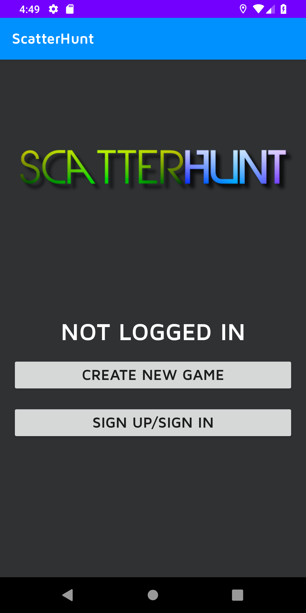
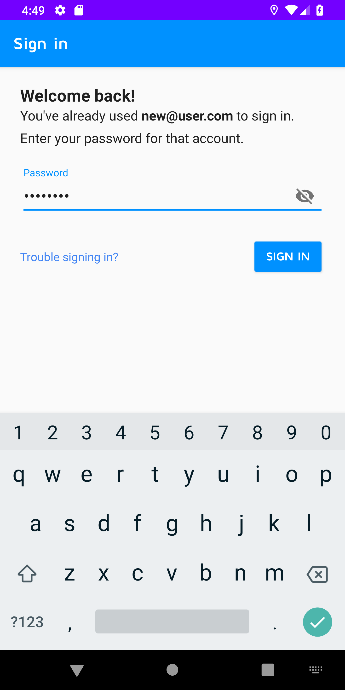
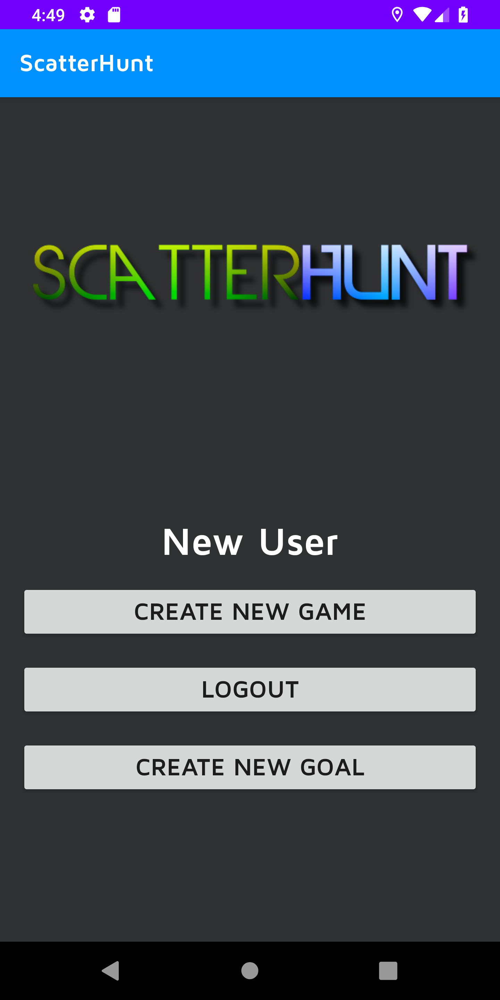
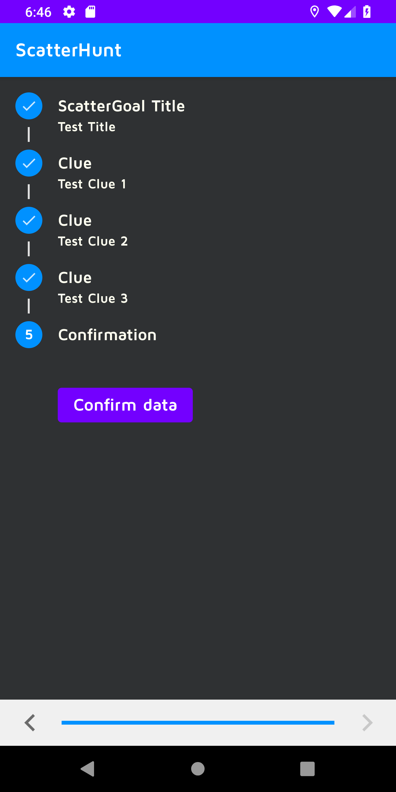
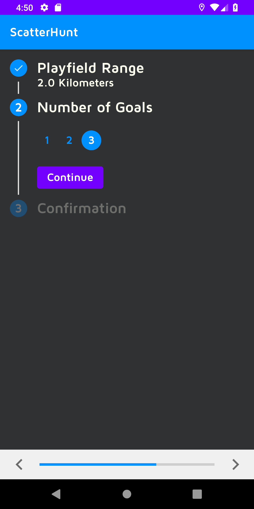
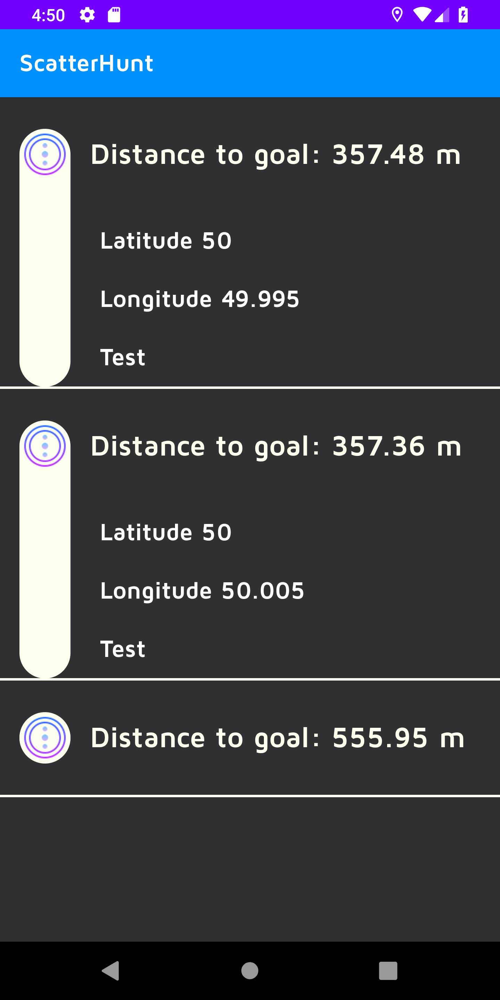
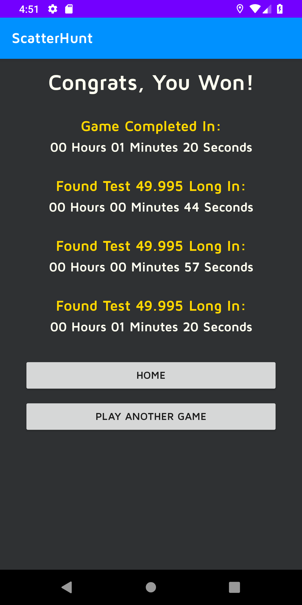

# ScatterHunt
### Project Overview:
**ScatterHunt** is a mobile scavenger hunt Android app that allows users the opportunity to plot their own route strategies to find all the goal locations they are given. The app uses geo-tagged locations as goals within the game and displays those goals as expandable lists to a user for them to accomplish in any order they decide.

Each goal list item displays a set of clues and the distance they are located relative to the user's current position (but not the direction). This means users need, based on the clues provided, should have a concept of where they are going to accomplish each geo-goal before they run off to complete their hunt. This creates a new dimension of optimization not found in other scavenger hunt games.

To accomplish a goal, the user must answer a question that is unique to an object at the goal they are headed to and input the answer in the list item. When all the goals have been visited and answers provided, Users are then redirected to a results 
view that displays stats on how they did while on the hunt!

### User Stories
- As a User I want to be able to get a list of destinations to find. (est 1hr)
    - Consideration: RecyclerView with user current game information. Store the current objectives on the user in the database so that if the app crashes or gets closed they don't lose their progress. This can be maintained with a timestamp on game start
    
- As a User I want to have a clean and easy to use UI for setting up games. (est 2hrs)
  - Consideration: Working in xml files to coordinate the design of each view.
  
- As a User I want to be able to see how long it took me to find all of the objectives I found in a game. (est 2hrs)
  - Consideration: Partially dependent on that start tim and also their completed times for each objective. Storing those in a table perhaps with what each are. Perhaps use RecyclerView on the score page also with start time and then location and completion time for each objective. Then a score at the bottom out of the total and a new game button
  
- As a Developer I should build an intuitive efficient way to store current game information; Including objective locations, starting time, and times when completed. (est 5 hrs)
  - Consideration: Use Firebase database to store game data once collected
  
- As a developer I want to be able alert users when they are within the vicinity of a goal (est 3hrs)
  - Consideration: Will require the creation of a geo-fence around the goal that triggers an event notification to the user when crossed that they have reached a goal
  
- As a developer I want to tell users their relative distance from the goals (est 2hr)
  - Consideration: May do the location distance calculation locally so that it doesn't require the phone to make a request every second to a backend. This will save on data for users as well as not bogging down a backend.

### Project Setup
- [ScatterHunt Wire Frames](https://app.moqups.com/OnBW3IthIY/view) (moqups.com)

## App Screenshots
#### Main Screen (Not Logged In)

  

#### Sign-in Screen

  

#### Main Screen (Logged In)

  

#### Create Goal

  

#### Create Game

  

#### Play Screen w/goals expanded

  

#### Post Game Stats

  

## ScatterHunt Group Agreement
### Communication plan
- Everyone gets to say something on a subject. 
- Before stand-up we meet and discuss what issues/bugs we have. Then in stand-up we can discuss them at a higher level.  
- We’ll create a safe space by respecting each other’s opinions and views. 

### Conflict plan 
- When there is a conflict, the two people will discuss it, if no resolution comes from that, then bring it to the whole team where we decide as a group as how to compromise and move forward. 
- Take time to consider and disconnect from the tension and take a walk or something.
- Always assume others have good intentions. 

### Git process 
- Nobody merges their own PR. The other pair needs to review and merge PR. 
- Have a development branch the everyone pulls from, then merge to development branch. When features are completed merge to master. 
- Master should have benchmarks: 
  - Android proof of life, users complete, MVP, features as completed. 

### Work plan
- We’re planning to use Github Issues to assign tasks. 
- Each morning we will decide who gets to work on each task (on volunteer basis). 
- The goal is to get everyone to be involved in each part of it. 
- Dave will be the head of getting Github issues worked out. 
- Mob Programming for day 1. 
- **Other:** 
  - Work Schedule: 
      - Everyone starts at 9am
      - 1 hr lunch break 
      - Check-in at 5pm, hard stop at 6pm 
      - Take breaks as needed 
  - Ask for help after 15 minutes. **Be receptive for help.**

## Deployment & Source
- [Google Play Store Deployemnt]() `Forthcoming`

## External Resources
* [Baeldung](https://www.baeldung.com/)(General Java code assistance)
<!-- Please read your README before submitting your project. -->
* [Spring Initializr](https://start.spring.io/) (uses dependencies: Web, devTools, postgreSQL, JPA, Security)
* [Location Tracking Information](https://www.androidauthority.com/create-a-gps-tracking-application-with-firebase-realtime-databse-844343/) (Article on how to build interval based location updates)
* [Expanding List Items](https://github.com/diegodobelo/AndroidExpandingViewLibrary/blob/master/README.md) (Used to create expanding goals in recycler view)
* [Form Stepper](https://android-arsenal.com/details/1/3843) (Used to create new goals)
* [Espresso Test Recorder](https://developer.android.com/studio/test/espresso-test-recorder)

## Creators
[Dave Muench](https://github.com/RazorWire13) | [Zahra Mohamed](https://github.com/zahram1087) | [Daniel Logerstedt](https://github.com/daniellogerstedt) | [Mason Bassett](https://github.com/bassettmason)
